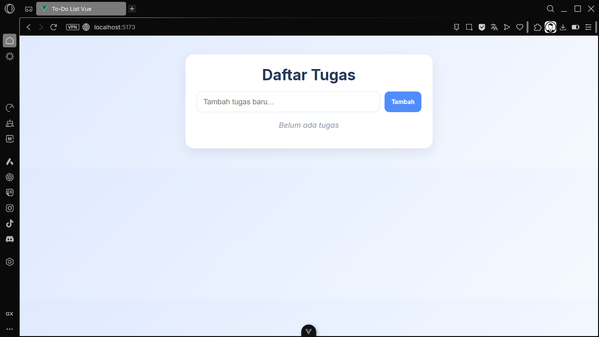
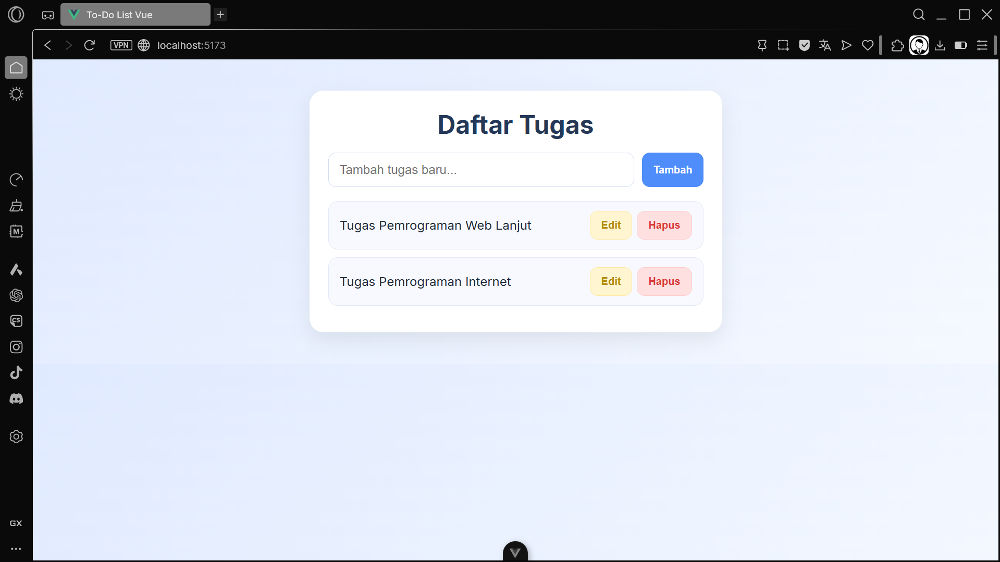
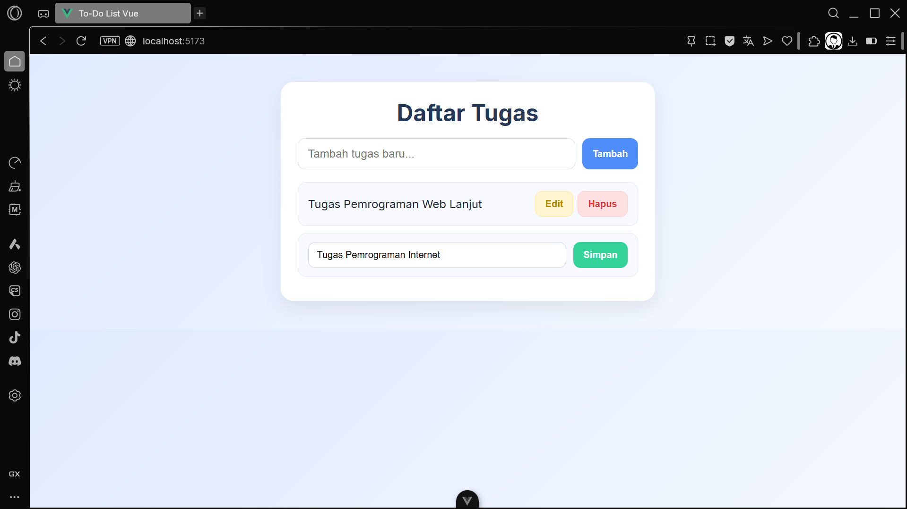

### To-Do List – Assignment Week 12

* **Nama** : Muh. Ressa Arsy Ma’rif
* **NIM** : F1D022137

---

**Deskripsi Tugas**

Pada tugas ini, saya membuat aplikasi **To-Do List sederhana** menggunakan **Vue.js 3**.
Aplikasi ini dibuat untuk memenuhi materi mengenai:

* Reaktivitas menggunakan `ref()`
* Event handling (`@click`, `@submit.prevent`)
* Two-way binding menggunakan `v-model`
* Render list menggunakan `v-for`
* Conditional rendering menggunakan `v-if`
* Transition animasi (`transition-group`)
* Menambahkan fitur **Edit Tugas**

---

**Fitur Aplikasi**

Aplikasi ini memiliki fitur:

 **Fitur Utama**

* **Tambah tugas baru**
* **Hapus tugas**
* **Edit tugas**
* **Menampilkan pesan jika daftar kosong**
* **Animasi fade saat item muncul/hilang**
---

**Struktur Folder (Default Vue 3 + Vite)**

```
todoVue_F1D022137/
│── node_modules/
│── public/
│── src/
│   ├── assets/
│   ├── App.vue   ← (kode utama To-Do List)
│   └── main.js
│── package.json
│── README.md
```

---

**Cara Menjalankan Proyek**

**1️. Clone Repository**

```sh
git clone https://github.com/RESSAARSY/week12-vue-todo-list.git
cd week12-vue-todo-list
```

**2. Install Dependencies**

```sh
npm install
```

**2. Jalankan Proyek**

```sh
npm run dev
```

---

**Kode Utama (App.vue)**

Kode lengkap aplikasi berada pada file:

```
src/App.vue
```

Aplikasi mencakup:

* State `tasks` dan `newTask`
* Fungsi `addTask()`, `deleteTask()`, `editTask()`, `saveTask()`
* Template list + input
* Animasi + styling modern

---

**Screenshot Program**

**Tampilan Halaman Utama**



**Setelah Menambahkan Tugas**



**Mode Edit Tugas**



---

**Penjelasan Singkat**

**addTask()**

* Mengambil input pengguna
* Menambahkan ke array `tasks`
* Menggunakan struktur objek `{ id, text, editing }`

**editTask()**

* Mengaktifkan mode edit dengan mengubah `editing = true`

**saveTask()**

* Menyimpan perubahan dan menonaktifkan mode edit

**deleteTask()**

* Menghapus item berdasarkan index

**v-for Render**

Menampilkan seluruh item tugas secara dinamis:

```vue
<li v-for="(task, index) in tasks" :key="task.id">
```

**Kondisi Daftar Kosong**

```vue
<p v-if="tasks.length === 0">Belum ada tugas</p>
```

---

**Kesimpulan**

Aplikasi To-Do List ini berhasil dibuat sesuai instruksi tugas dengan tambahan fitur **Edit Tugas** dan tampilan UI yang modern serta bersih. Seluruh fungsi berjalan secara reaktif berkat pemanfaatan konsep dasar Vue.js.


---